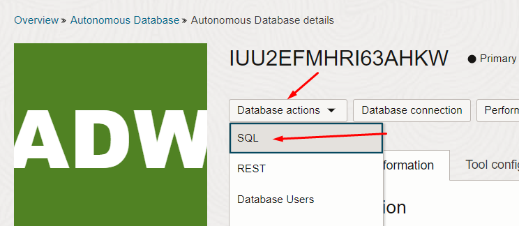

# Download Files from Oracle Object Storage into Oracle Autonomous Database Using DBMS_CLOUD.GET_OBJECTS

## Introduction

In the world of cloud computing, managing and transferring data efficiently is crucial. Oracle provides a robust ecosystem for data management with its Oracle Object Storage and Oracle Autonomous Database (ADB). One of the most powerful features available is the ability to download files directly from Oracle Object Storage into Oracle ADB using the DBMS_CLOUD.GET_OBJECTS procedure.

This blog post will guide you through the steps to accomplish this task, ensuring a smooth and efficient data transfer process.

## Objectives

By following this guide, you will:

- Create a credential object in Oracle ADB for accessing Oracle Object Storage.
- Grant necessary privileges to use DBMS_CLOUD procedures.
- Download files from Oracle Object Storage into Oracle ADB using DBMS_CLOUD.GET_OBJECTS.
- Verify the downloaded files in Oracle ADB.
- Upload ONNX files into the database using DBMS_VECTOR.LOAD_ONNX_MODEL.

## Prerequisites

Before we dive into the procedure, make sure you have the following:

1. **Oracle Cloud Account**: You need an active Oracle Cloud account with access to Oracle Object Storage and Oracle Autonomous Database.
2. **Object Storage Bucket**: Create a bucket in Oracle Object Storage and upload the files you want to download into Oracle ADB.
3. **Credentials**: Ensure you have the necessary credentials (access key and secret key) to access Oracle Object Storage.
4. **Oracle Autonomous Database**: Make sure you have an [Oracle Autonomous Database](https://medium.com/@bhenndricks/how-to-create-an-oracle-autonomous-database-c12d9a05096c) instance running.

## Step-by-Step Guide

### 1. Create Credential Object in Oracle ADB

First, create a credential object in your Oracle Autonomous Database that will store your Object Storage credentials. This is required for authenticating with Oracle Object Storage. Please set up your [secret keys](https://medium.com/@bhenndricks/secure-access-to-oracle-buckets-in-object-storage-a-step-by-step-guide-32f3242f35e2) 


Next head back to your ADW overview page we just created, and select Database Actions and then SQL. This will open up an editor for us to perform statements.


Go ahead and copy this statement and follow the instructions to replace the necessary credentials we have created.

```sql
BEGIN
  DBMS_CLOUD.CREATE_CREDENTIAL(
    credential_name => 'OBJ_STORE_CRED',
    username => '<your_object_storage_access_key>',
    password => '<your_object_storage_secret_key>'
  );
END;
/
```

Replace `<your_object_storage_access_key>` and `<your_object_storage_secret_key>` with your actual Oracle Object Storage access key and secret key.

### 2. Grant Necessary Privileges

Ensure your database user has the necessary privileges to use DBMS_CLOUD procedures.

```sql
GRANT EXECUTE ON DBMS_CLOUD TO <your_database_user>;
```

Replace `<your_database_user>` with your actual database user.

### 3. Download Files Using DBMS_CLOUD.GET_OBJECTS

Now, use the DBMS_CLOUD.GET_OBJECTS procedure to download files from your Oracle Object Storage bucket into Oracle ADB.

```sql
BEGIN
  DBMS_CLOUD.GET_OBJECTS(
    credential_name => 'OBJ_STORE_CRED',
    object_uri => 'https://objectstorage.<region>.oraclecloud.com/n/<namespace>/b/<bucket>/o/<file>',
    directory_name => 'DATA_PUMP_DIR',
    file_name => '<file_name_in_adb>'
  );
END;
/
```

Replace the placeholders as follows:
- `<region>`: Your Oracle Cloud region.
- `<namespace>`: Your Oracle Cloud Object Storage namespace.
- `<bucket>`: The name of your Object Storage bucket.
- `<file>`: The name of the file in your Object Storage bucket.
- `<file_name_in_adb>`: The name you want to give the file in Oracle ADB.

For example, if your object URI is https://objectstorage.us-ashburn-1.oraclecloud.com/n/my_namespace/b/my_bucket/o/my_file.csv, and you want to store it in ADB as my_file.csv, the command will look like this:

```sql
BEGIN
  DBMS_CLOUD.GET_OBJECTS(
    credential_name => 'OBJ_STORE_CRED',
    object_uri => 'https://objectstorage.us-ashburn-1.oraclecloud.com/n/my_namespace/b/my_bucket/o/my_file.csv',
    directory_name => 'DATA_PUMP_DIR',
    file_name => 'my_file.csv'
  );
END;
/
```

### 4. Verify the File in Oracle ADB

After downloading the file, you can verify its existence in Oracle ADB by listing the contents of the directory.

```sql
SELECT * FROM TABLE(DBMS_CLOUD.LIST_FILES('DATA_PUMP_DIR'));
```

This query will show you the files present in the specified directory, ensuring that your file has been successfully downloaded.

### 5. Upload ONNX Files into the Database

Once the ONNX files are downloaded and verified, you can upload them into the database using DBMS_VECTOR.LOAD_ONNX_MODEL. This step involves loading the models from the downloaded files and configuring them for use in Oracle ADB.

```sql
BEGIN
  DBMS_VECTOR.LOAD_ONNX_MODEL(
    'DATA_PUMP_DIR',
    'tinybert.onnx',
    'TINYBERT_MODEL',
    json('{"function":"embedding","embeddingOutput":"embedding","input":{"input":["DATA"]}}')
  );

  DBMS_VECTOR.LOAD_ONNX_MODEL(
    'DATA_PUMP_DIR',
    'all-MiniLM-L6-v2.onnx',
    'ALL_MINILM_L6V2MODEL',
    json('{"function":"embedding","input":{"input":["DATA"]}}')
  );
END;
/
```

This code uploads two ONNX models (tinybert.onnx and all-MiniLM-L6-v2.onnx) into the Oracle ADB, making them available as TINYBERT_MODEL and ALL_MINILM_L6V2MODEL respectively. The json configuration specifies how the models should handle input and output data.

## Conclusion

Downloading files from Oracle Object Storage into Oracle Autonomous Database using DBMS_CLOUD.GET_OBJECTS is a straightforward process. By following the steps outlined in this guide, you can efficiently manage your data transfers within the Oracle Cloud ecosystem. Once your files are downloaded, you can further extend their utility by uploading ONNX models into your database, enabling advanced data processing and machine learning tasks.
